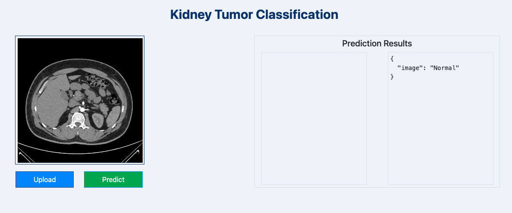

## This is an END-to-END CNNClassifier with MLOps Project
This is a Kidney tumour detection classification project with MLOps, DVC and Flask Application for predictions. It is trained on VGG16 keras model.

[Source dataset](https://www.kaggle.com/datasets/nazmul0087/ct-kidney-dataset-normal-cyst-tumor-and-stone/code) was collected from PACS (Picture archiving and communication system) from different hospitals in Dhaka, Bangladesh where patients were already diagnosed with having a kidney tumor, cyst, normal or stone findings. Both the Coronal and Axial cuts were selected from both contrast and non-contrast studies with protocol for the whole abdomen and urogram. 


*After downloading the dataset, zip it and push it to google drive and use gdown to download it into your system while running to save space.*

1. View my research folder to know more about the experiments.

To run this project :
1. ```
    git clone https://github.com/Shreyansh-1998/MLOps_CNNClassifier.git
   ```
2. ```
    conda create -n your_env python==3.8 -y
    ```
3. ```
    conda activate
   ```
4.  ```
    pip install -r requirements.txt
    ```
5.  ```
    python3 main.py
    ```
6.  ```
    python3 app.py
    ```
This project also contains Data Version Control(Dvc) for pipeline tracking to save computational power. It is integrated with Mlflow to track experiments using [Dagshub](https://dagshub.com/).

1. Login to dagshub.
2. Connect the git repository you want to track.
3. Export env_variables for remote server
```
export [MLFLOW_TRACKING_URI]="remote_uri"
```
```
export [MLFLOW_TRACKING_USERNAME]= "your_username"
```
```
export [MLFLOW_TRACKING_PASSWORD]= "your_password"
```
4. Run the experiments and it logs metrics and parameters

[MLflow tutorial and documentation](https://mlflow.org/)


Steps for dvc execution:

```
dvc init
```
```
dvc dag
```
```
dvc repro
```
#### Flask Application Predictions


